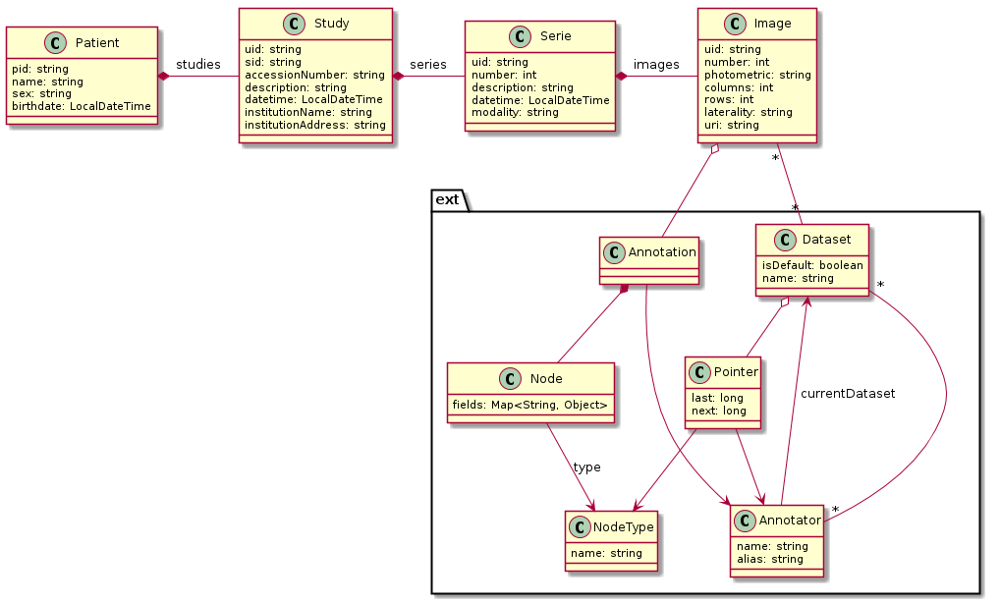

# r-pacs-plugin
R-PACS is a [Dicoogle](https://github.com/bioinformatics-ua/dicoogle) plugin that has a semi-structured model, composed by the DICOM structure and the extension model to DICOM instances. It was primarily designed for the project of Diabetic Retinopathy Screening, but can be used on any context where a set of annotations are applied to DICOM images.

## Model
OR-Model source is at package pt.ua.ieeta.rpacs.model, and can be represented by the Class Diagram: 

## Project Build
Build requirements:
* Java version >= 8
* Maven version >= 3.3

In the project folder just fire maven install:
```bash
mvn install
```

## Service Requirements
R-PACS plugin requires the availability of the following software services:
* PostgreSQL >= 9.5
* ElasticSearch => 5.4

To install the DB schema run the script db-create-all.sql available at the ./postgresql folder, and all the database evolutions in the correct order, available at ./postgresql/evolutions folder.

## Plugin Settings
R-PACS is installed as any other Dicoogle plugin, copy it to the Plugin folder and set the settings in the ./settings/r-pacs.xml file:
```xml
<configuration>
  <docUrl><elastic-search service url></docUrl>
  <dbUrl><jdbc config></dbUrl>
  <driver>org.postgresql.Driver</driver>
  <username><postgresql db username></username>
  <password>postgresql db password</password>
</configuration>
```

Example pointing to local instalations of PostgreSQL and ElasticSearch:
```xml
<configuration>
  <docUrl>http://127.0.0.1:9200</docUrl>
  <dbUrl>jdbc:postgresql:db-name</dbUrl>
  <driver>org.postgresql.Driver</driver>
  <username>user</username>
  <password>password</password>
</configuration>
```

## Available Dicoogle services
The R-PACS will install the r-pacs-query Query Plugin and the r-pacs-indexer Indexer Plugin.

## CLI
The generated jar file ./target/r-pacs-plugin-<version>-jar-with-dependencies.jar also has some minor Command Line Interface functionalities. There is a ./rpacs bash file to help using the CLI. E.g execute to see the help menu:
```bash
$ ./rpacs -h
Usage: rpacs [-h] [--create=<create>] [--drop=<drop>] [--from=<from>]
      [--index=<index>] [--search=<search>] [--size=<size>]
R-PACS CLI Helper
      --create=<create>       Create document store indexes. Options:
 all
                                -> create all r-pacs indexes 
 <name> -> create
                                index with name
      --drop=<drop>           Drop document store indexes. Options:
 all    ->
                                drop all r-pacs indexes 
 <name> -> drop index
                                with name
      --from=<from>           Search results from a position
      --index=<index>         Index r-pacs model from database to the document
                                store. This can take some time! Options: all
                                -> index all r-pacs indexes 

      --search=<search>       Search in r-pacs document store. Default to
                                --from 0 --size 100
      --size=<size>           Search results limit
  -h, --help                  Display this help and exit.
Copyright(c) 2017
```

The CLI uses the local config at ./ebean.properties similarly to the settings for Dicoogle. E.g indexing all the DB model is executed with:
```bash
$ ./rpacs --index all
```